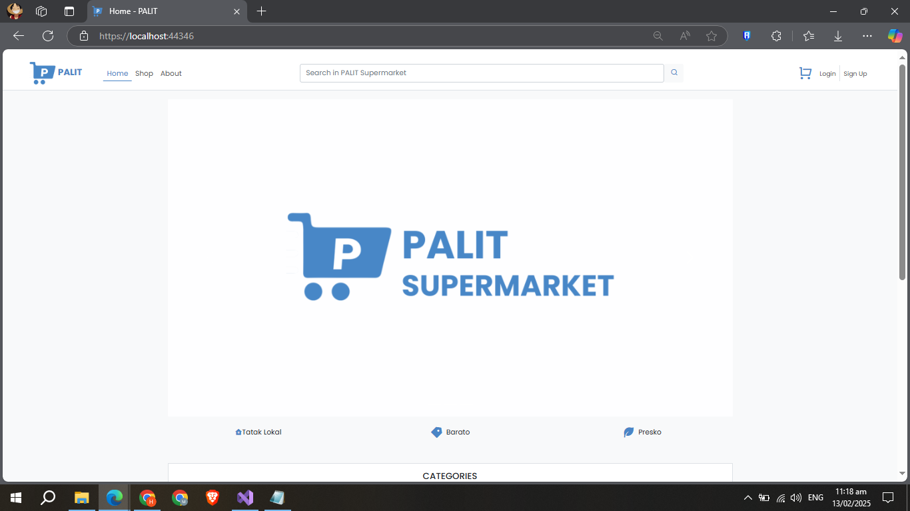
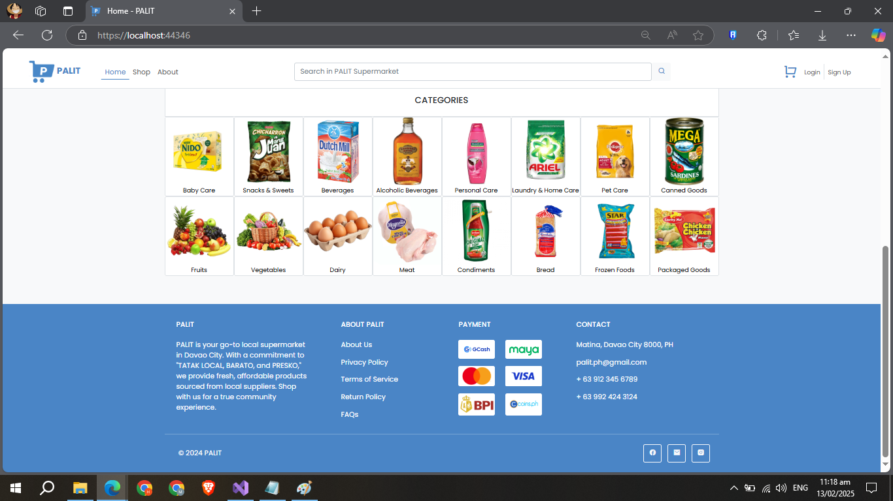
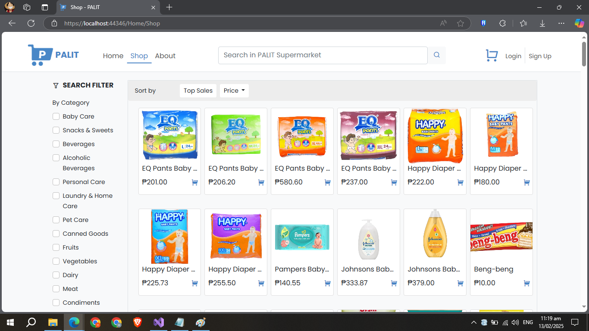
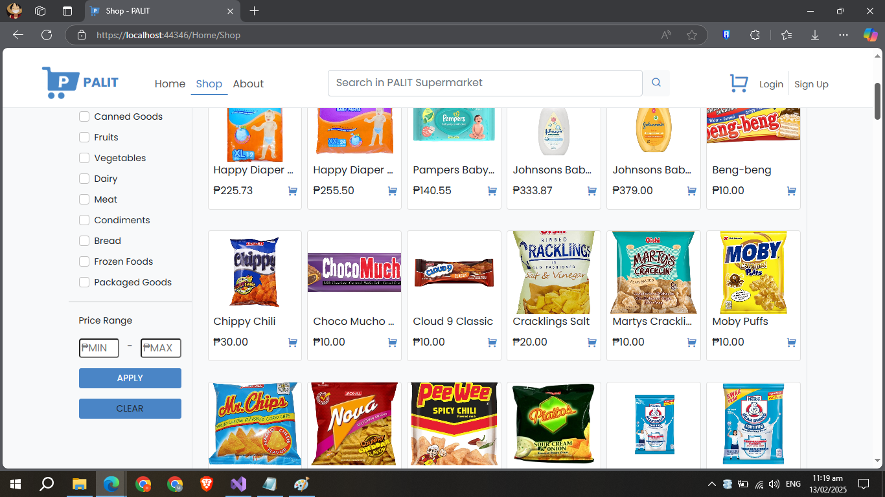
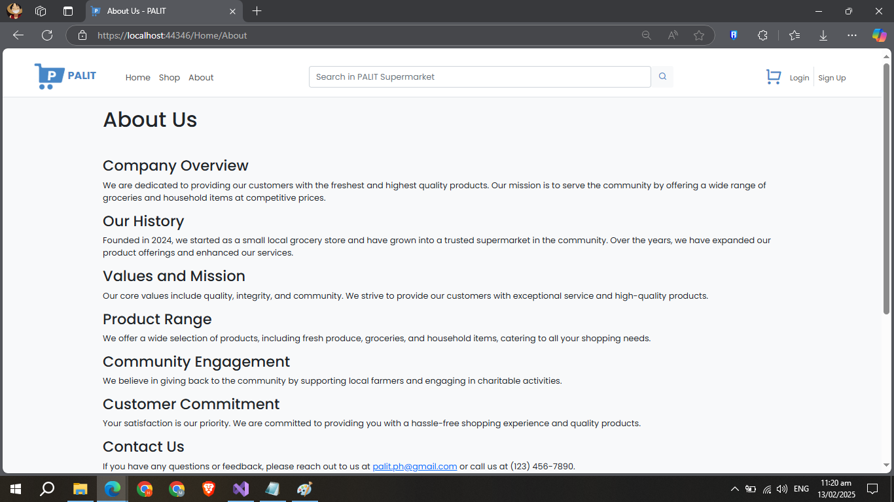

🛒 PALIT - E-Commerce Platform

📌 Project Overview
This is an e-commerce platform developed as part of our IT15 (Integrative Programming and Technologies) course. The project is built using ASP.NET Core MVC as the framework and SSMS (SQL Server Management Studio) as the database.

🔧 Technologies Used
Frontend & Backend: ASP.NET Core MVC
Database: SQL Server (SSMS)
APIs:
PayMaya (Payment integration)
MailGun (Email notifications)
Entity Framework (for database management)

🚀 Features
✅ User authentication (Login/Register)
✅ Product listing and search functionality
✅ Shopping cart and checkout process
✅ Payment integration with PayMaya
✅ Email notifications via MailGun
✅ Order tracking

📸 Screenshots  
  
  
  
  
  

👥 Contributors
Hannah Grace M. Tano - Full Stack Developer
Oscar Jay Queman - Backend Developer
